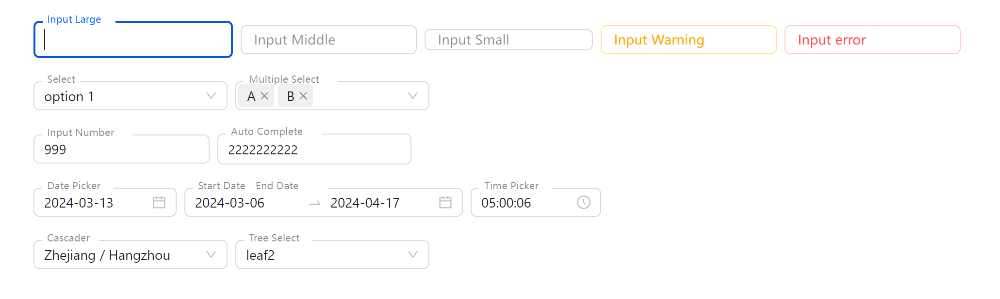

# Antd 5 form style similar to MUI

```sh
npm install ant-float-label
```

```js
import {
  FloatDatePicker,
  FloatInput,
  FloatInputNumber,
  FloatSelect,
  FloatRangePicker,
  FloatCascader,
  FloatTreeSelect,
  FloatAutoComplete,
  FloatTimePicker,
  FloatPassword,
} from "ant-float-label";
```



# useForm

```js
import { Form } from "antd";
import { FloatAutoComplete, FloatFormItem } from "ant-float-label";

function TestUseForm() {
  const [form] = Form.useForm();

  return (
    <Form name="test_form" form={form}>
      <FloatFormItem
        name="floatAutoComplete"
        rules={[{ required: true }]}
        label="FloatAutoComplete"
      >
        <FloatAutoComplete
          options={[
            { value: "11111111111" },
            { value: "2222222222" },
            { value: "3333333333" },
          ]}
        />
      </FloatFormItem>
    </Form>
  );
}
```
